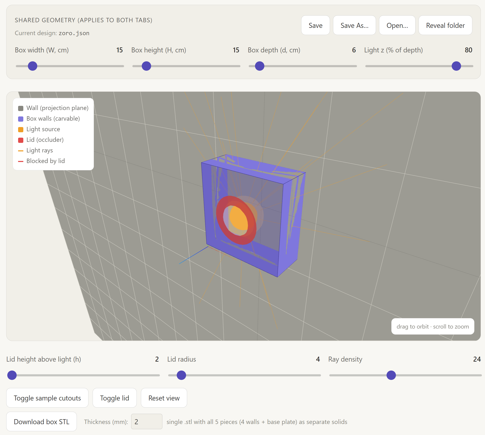
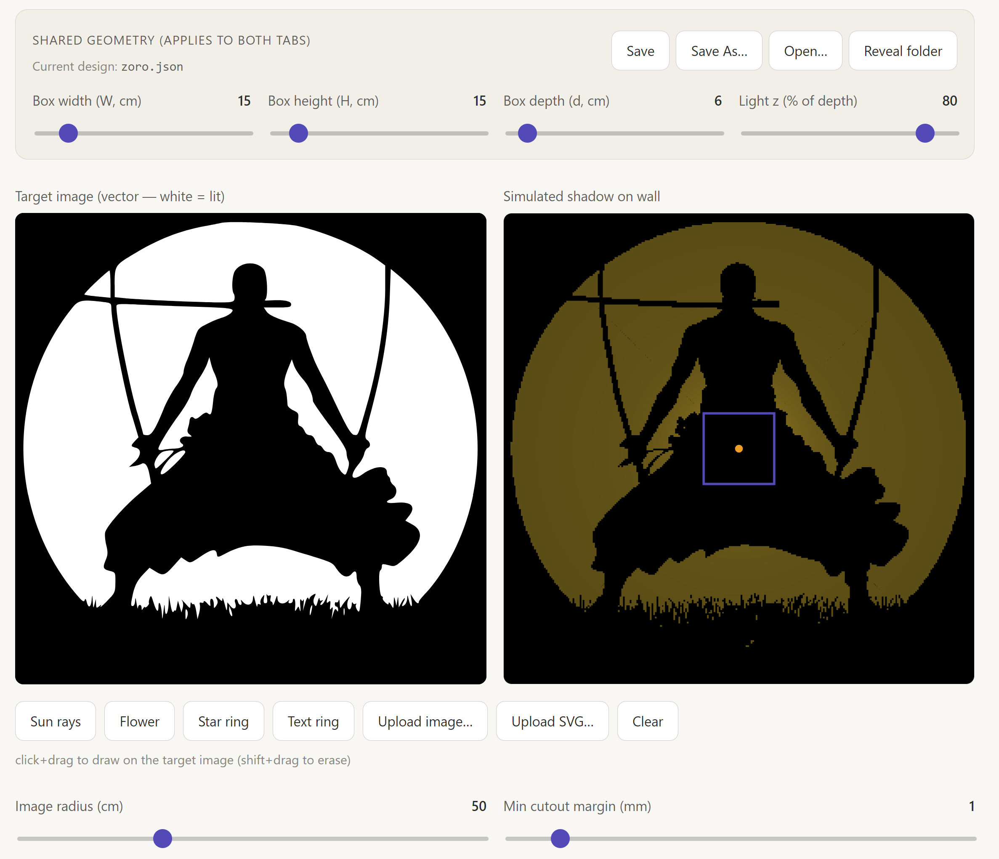
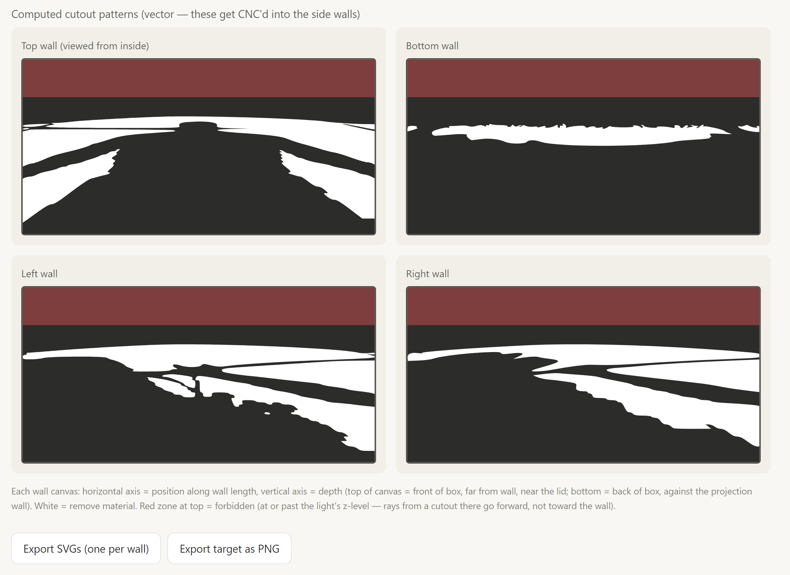

# Shadow Box Designer

Interactive desktop app for designing wall-mounted shadow lamps. You design a circular target image, the tool inverse-projects it into the cutout patterns each side wall of the box must have, and exports both **SVG** files (for CNC) and a single **STL** file containing all four walls + a base plate (for 3D printing). The math, the 3D preview, and the cutout/STL outputs all stay in lock-step as you adjust the box dimensions and light position.



## What the app does

- **3D Geometry tab** — live three-dimensional preview of the box. Walls show the actual cutout pattern (transparent where light passes through). The light source, lid (forward-glare blocker), and a fan of rays through the cutouts are visible. Drag to orbit, scroll to zoom.
- **Pattern Designer tab** — top: the target image you design (presets, brush, image upload, SVG upload), the simulated shadow as it would appear on the wall, and the shared box dimension sliders. Below: the four computed wall cutout patterns rendered as live SVG.
- **Math Reference tab** — the projection equations with notation matching the code.



## Inputs

You can build a target pattern from any of:

- **Built-in presets** — sun rays, flower, star ring, text ring.
- **Brush** — click and drag to paint, shift+drag to erase.
- **PNG / JPG upload** — opens a crop modal: pan with drag, zoom with scroll wheel, the inscribed circle defines the kept region. Apply commits a grayscaled, circle-masked result.
- **SVG upload** — same crop flow, with a white background injected so transparent SVG icons render with usable contrast (dark fills become the unlit silhouette).

## Computed cutouts

Each side wall of the box gets its own cutout pattern, computed by inverse-projecting the target image through the light source. The four panels below update live as you draw, change box dimensions, or move the light position.



## Shared geometry panel

`W`, `H`, `d`, and `Light z%` are shared between both tabs — change one and both views update. Everything is in centimeters; cutout / STL output is in millimeters.

## Saving and opening designs

- **Save** writes to the current file (becomes "Save As" if no current file is set).
- **Save As…** prompts for a name and writes to `%APPDATA%\shadowbox-designer\designs\<name>.json`.
- **Open…** lists every saved design with a delete button per row.
- **Reveal folder** opens the data directory in Explorer.

A green "Saved" toast confirms successful writes for 5 seconds.

## Outputs

- **SVG cutouts** — `Export SVGs` from the Pattern Designer tab. One SVG per wall, sized in mm, ready for CNC. Cutouts are traced from the binary mask via [`potrace`](https://www.npmjs.com/package/potrace) — the same algorithm Inkscape uses.
- **3D model STL** — `Download box STL` from the 3D Geometry tab. A single `.stl` file containing five separate solids: `wall-top`, `wall-bot`, `wall-left`, `wall-right`, `base-plate`. PrusaSlicer / Cura recognize them as independent objects on import. Default thickness 2 mm; change it in the Thickness input before clicking download.

The four wall STLs have through-holes for each cutout; the base plate is a solid `W × H × thickness` panel (the front cap of the box). Pieces are laid out side-by-side in the STL so they don't overlap when the slicer first arranges them.

## Math reference

The Math Reference tab inside the app renders the forward / inverse maps and the penumbra estimate with current parameters substituted in. The short version:

```
forward map (right wall):    t = c_z / (c_z - z),   X = (W/2)·t,   Y = u·t
inverse map (right wall):    t = X / (W/2),         z = c_z·(1 - 1/t),   u = Y/t
penumbra blur (any wall):    blur = D · (2X/W − 1)
```

`c_z` is the bulb's z-coordinate (the "Light z %" slider × box depth `d`). Notice the penumbra formula doesn't depend on `d` — box depth is your "how thick do I want this physically" knob, not "how sharp is the image." Width `W` is your sharpness lever.

## Run it

Requires [Node.js](https://nodejs.org/) (LTS, e.g. 20.x).

```bash
npm install
npm start                  # launch the desktop app
npm run build:win          # produce a Windows installer in dist/
```

The Windows installer registers `%APPDATA%\Shadow Box Designer\designs\` as the data folder. A bundled sample (`zoro.json`) is seeded into that folder on first launch — you can open it from the **Open…** dialog right away.

You can also serve the renderer as a static page in any browser:

```bash
python3 -m http.server 8000
# open http://localhost:8000
```

In browser mode, Save / Save As / Open back onto `localStorage` instead of the filesystem, and tracing falls back to [`imagetracerjs`](https://github.com/jankovicsandras/imagetracerjs) loaded from CDN. Useful for quick iteration; not portable between browsers.

## Project layout

Standard Electron split: `electron/` for the Node side, `renderer/` for the browser-side app.

```
shadowbox/
├── package.json            npm scripts + electron-builder config
├── electron/
│   ├── main.cjs            BrowserWindow + IPC handlers (designs, potrace trace)
│   ├── preload.cjs         contextBridge → window.appAPI
│   └── samples/            JSON files seeded into the user data folder on first launch
├── renderer/
│   ├── index.html
│   └── src/
│       ├── projection.js   Pure forward/inverse-map math
│       ├── geometry.js     Three.js 3D scene (box, light, lid, ray fan, textured cutouts)
│       ├── designer.js     Target image, brush, presets, image/SVG upload, simulator, wall traces
│       ├── stl_export.js   Trace mask → polygon flatten → Shape with holes → ExtrudeGeometry → ASCII STL
│       ├── storage.js      Renderer storage (Electron IPC or localStorage fallback)
│       ├── main.js         Tab switching, slider wiring, save/load modals, downloads
│       └── styles.css
└── README.md
```

## Notes on print / CNC

- **STL holes are inset 0.3 mm** from the wall edges. Tracers can emit polygons that sit right on (or fractionally past) the pixel grid boundary, which makes ExtrudeGeometry produce malformed faces. Inset keeps everything inside the wall rectangle. Adjust `EPS` in `stl_export.js` if 0.3 mm is too aggressive — but going lower than your printer's nozzle width or your CNC router's kerf doesn't gain you anything.
- **SVG export units are mm.** 1 unit in the math = 1 cm; the export scales by 10.
- **Test on scrap first.** The projection math is sensitive to the actual position of the light source. A 2 mm shift of the bulb visibly displaces outer features.
